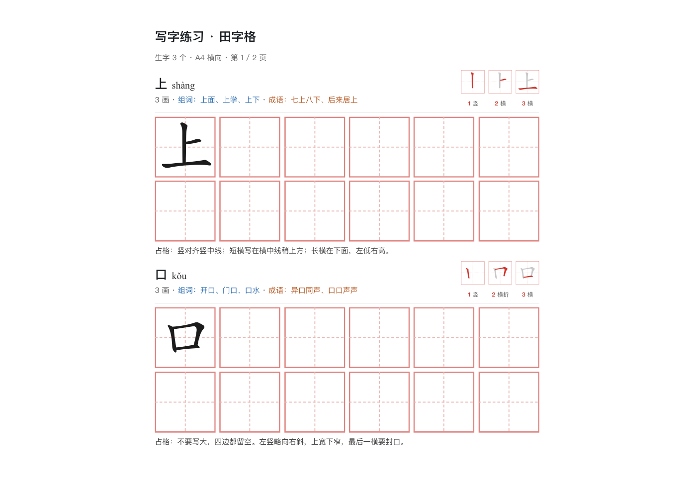
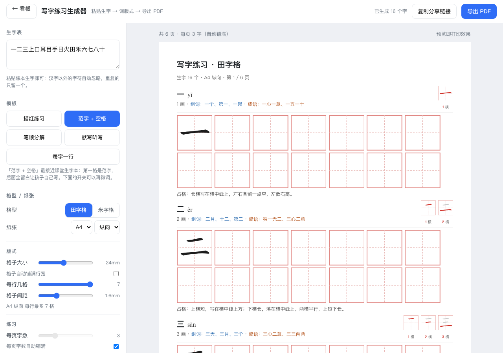

# 小朋友工具箱

> 给家长和小朋友的免费小工具 · 纯网页、免登录、不收集任何数据

**🌐 在线使用：<https://yuehuang.github.io/>** ｜ 字帖生成器：<https://yuehuang.github.io/tianzige/>

粘贴课本生字 → 自动生成 A4 练习页：**范字 + 笔顺条 + 空白格**。可调格子大小 / 每页字数 / 每行几格 / 描红格数 / 田字格·米字格 / A4·A5·横向，带拼音、组词、成语、占格提示，点「导出 PDF」即可打印。



<details>
<summary>看工具界面 / 看板首页</summary>




</details>

## 本地用

双击 `index.html` 就行——数据用 `<script>` 加载，`file://` 直接打开也能完整运行，不依赖网络。

## 更新线上

```bash
git add -A && git commit -m "改了什么" && git push     # 约 1 分钟后自动生效
```

## 数据来源与授权

| 内容 | 来源 | 授权 |
|---|---|---|
| 汉字笔画 / 中心线 | [Make Me a Hanzi](https://github.com/skishore/makemeahanzi) → [hanzi-writer-data](https://github.com/chanind/hanzi-writer-data) | Arphic Public License（见 `ARPHICPL.TXT`） |
| 拼音 | [pinyin-data](https://github.com/mozillazg/pinyin-data) | MIT |
| 词组 / 成语 / 占格提示 | 本项目整理（一年级上册第一课 16 字） | 随本项目 |

代码为 MIT（见 `LICENSE`）。再次分发请保留 `ARPHICPL.TXT` 和 `NOTICE`。
